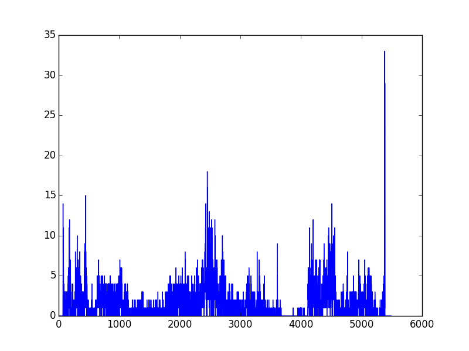
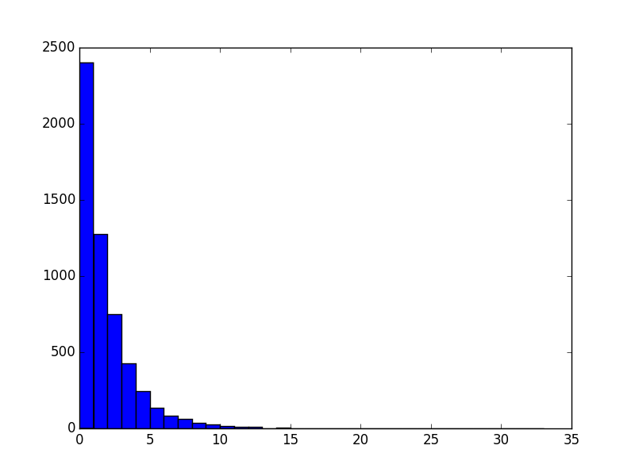
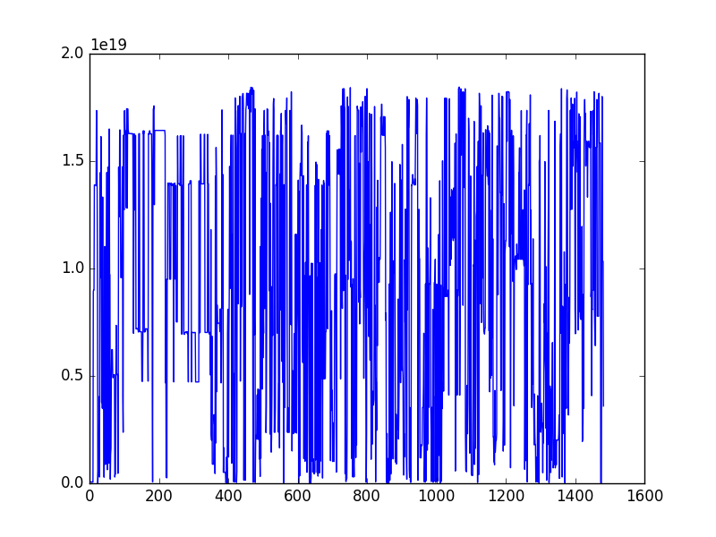
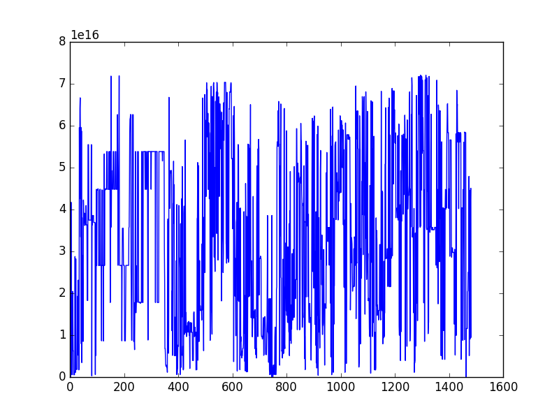
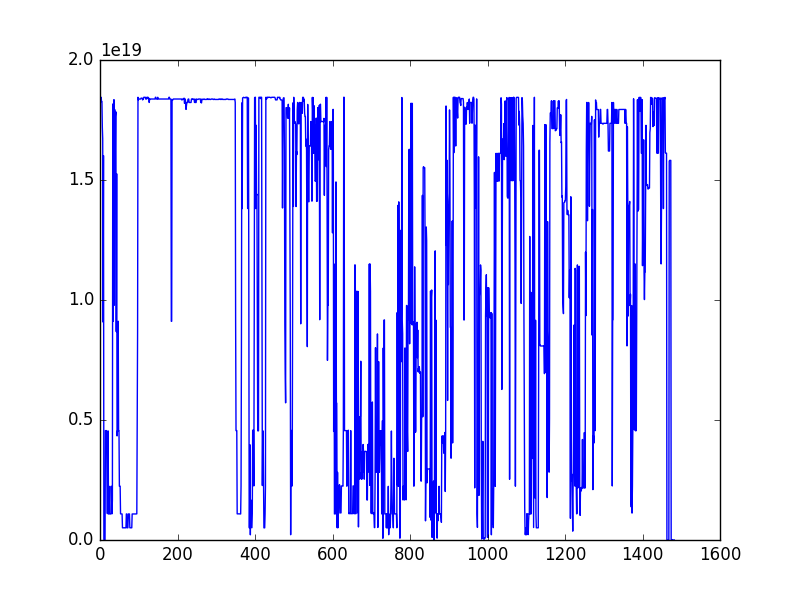

# SCENE DETECTION
==================

## Idea
--------

The purpose of this project is to try to find a method to detect the scenes
changing in a video in a robuster way than searching the fadeout pics...

To solve this problem, I choose to use the perceptual hash of the image and
compute the distance between 2 frames... becausein a same scene, 2 successive
frames should be really similar : the distance between 2 hash small.

To compute the distance between two frames, once hashed using the perceptual
hash algorithm, a simple hamming distance should be enought.

## Example
-----------

Let's take a simple video of about 3 minutes and plot the distance inter
frames on a line... we get this :

And if now I draw the reparition of the distances as an histogram, this is what I get :

## Perceptual Hashing
----------------------

I've tryied on a same video 3 differents perceptual hashes implemented in the file function : phash64, dhash, dhash_freesize.

That's how the distance inter-frames looks, for each.

Using dhash : 

Using dhash_freesize : 

Using phash64: 

## Troubleshooting

`apt-get` sometimes fail

## TODOS

### cli
- time precision => dest fps
- size precision => dest images resolution

So, I think, there is something interesting to search...
